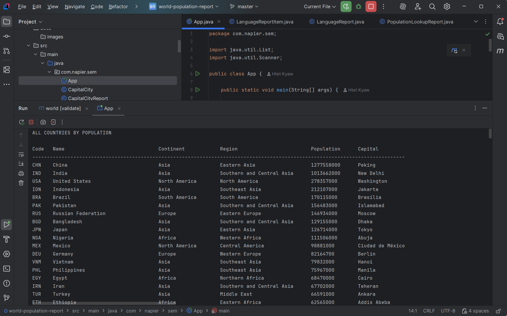
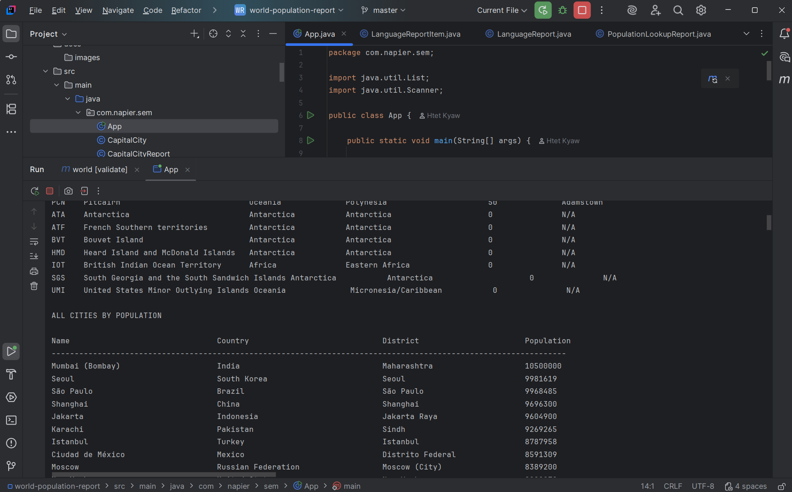
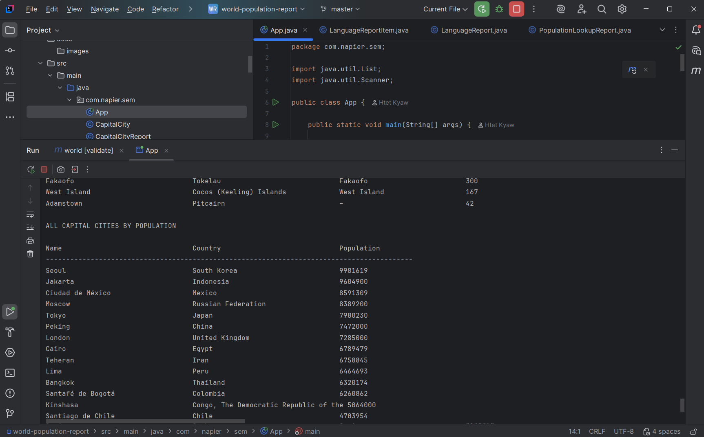
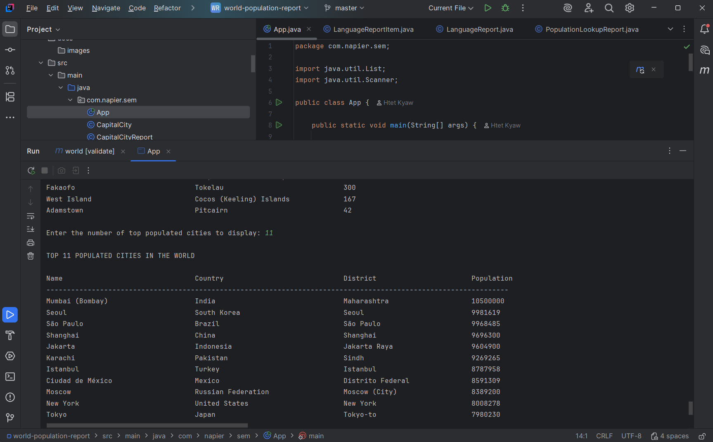
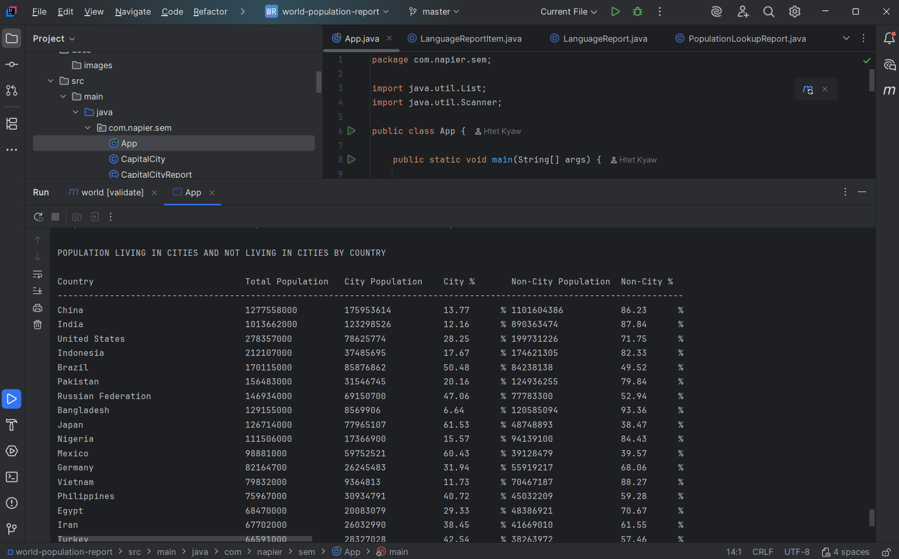
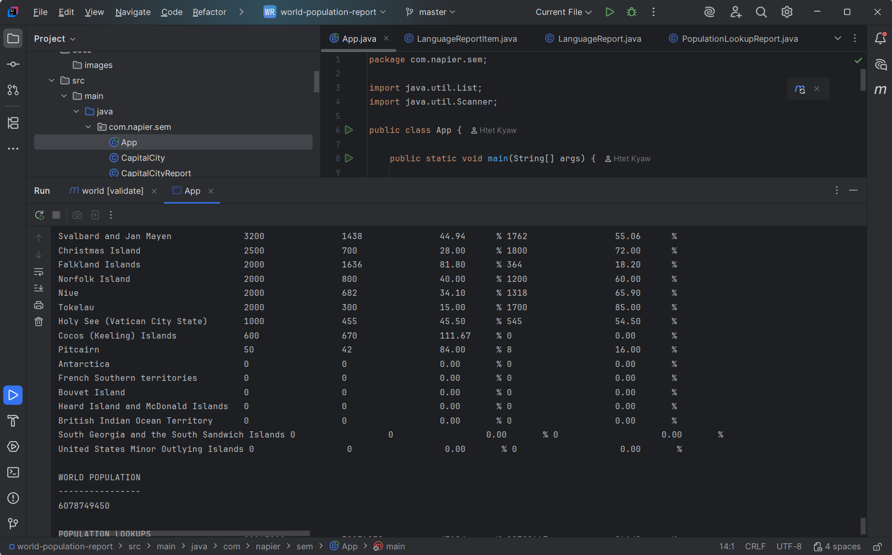
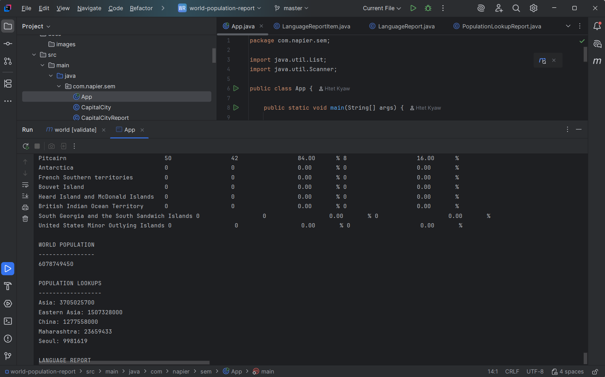
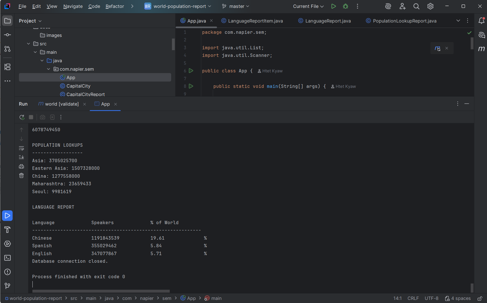

## Requirements Evidence

| ID | Requirement | Met | Screenshot |
|---|---|---|---|
| 1 | All countries in the world organised by largest population to smallest | Yes |  |
| 2 | All cities in the world organised by largest population to smallest | Yes |  |
| 3 | All capital cities in the world organised by largest population to smallest | Yes |  |
| 4 | Top N populated cities in the world | Yes |  |
| 5 | Population living in cities and not living in cities | Yes |  |
| 6 | World population | Yes |  |
| 7 | Population lookup by continent, region, country, district, and city | Yes |  |
| 8 | Chinese, English, and Spanish language population report | Yes |  |